# makino-data-slides — Data tells the story

数据分析结论直接生成文章级配图，省掉手动做图做排版，带观点带叙事带图表。

## Install

```bash
cd ~/.claude/skills/
git clone https://github.com/makinotes/makino-data-slides.git
```

Then type `/makino-data-slides` in Claude Code.

## Usage

```
/makino-data-slides
```

Interactive mode: provide your data file + narrative direction, get slide cards.

```
/makino-data-slides path/to/data.xlsx
```

Generate slides from a data file (Excel/CSV/JSON/markdown).

## Best with Strong Reasoning Models

This skill is not just "draw a chart" — it's **analyze data → form opinions → generate visual cards with narrative**. The quality of the takeaway line, the choice of comparison angle, the storytelling order — all depend on the model's ability to reason about the data.

**Recommended**: Use with Claude Code's default model (Opus-class) for best results. Weaker models tend to produce generic takeaways and miss non-obvious patterns in the data.

## Features

- Each card 1080x720, fixed 5-layer structure (header → takeaway → chart → footer)
- Playwright auto-screenshot, ready to embed in articles
- Investor-report visual language: hero numbers, stat boxes, ECharts charts, insight callouts
- Not a chart tool (use `/chart` for that) — this is data analysis → opinionated visual cards

## What Problem Does This Solve

You finished a data analysis, conclusions scattered across notebooks, and you want article-grade illustrations. Screenshots are ugly, redoing in Figma is slow. This skill turns Excel data directly into publishable visual cards with narrative and opinions — no design tool needed.

## When to Use This

| Need | Use this? | Use instead |
|------|-----------|-------------|
| Single chart (line/bar/pie) | No | `/chart` |
| Article → navigable slide deck | No | `/article-to-slides` |
| Cover image for article | No | `/cover-gen` |
| **Data analysis → multi-slide cards with narrative** | **Yes** | — |

## Input

Primary: **Excel/CSV with structured data** (scores, rankings, time series, category breakdowns).

Also works with JSON, markdown tables, or verbal description of data + conclusions.

## Output

Single self-contained HTML file. All CSS and JS inline. Only external dependency: ECharts CDN.

No PowerPoint, no Keynote, no dependencies. Open in any browser, share as a file, or screenshot individual slides.

Each slide is screenshot-ready at 1080x720 via Playwright.

## Themes & Customization (Coming in v4.2)

The skill comes with built-in themes optimized for different audiences. You can customize your slides locally:

**Built-in Themes**:
- `investor`: Hero numbers + stat boxes + grouped charts (current default)
- `editorial`: Image-heavy layout, narrative flow, annotation-rich callouts
- `executive`: Minimal design, max data density, for C-suite decks

**Local Customization** (in development):
- Create `~/.makino-data-slides/themes/` and add your own YAML theme files
- Override colors, fonts, layout per slide using frontmatter
- Support for `--theme custom_name` to use your theme

**Roadmap** (v4.2, June 2026):
- Theme inheritance — extend built-in themes without copying
- Live theme editor — preview color changes in real-time
- Preset color palettes — switch between "investor blue", "warm sunset", "minimalist monochrome"

For now, all users see the investor theme. If you want to define your own color system, open an issue and describe what you need.


## Demo

### Demo 1: Logistics — Holiday Order Analysis (4 slides)

Pre/post holiday order volume analysis — grouped bar, area chart, composition breakdown, monthly summary.

| | |
|---|---|
| 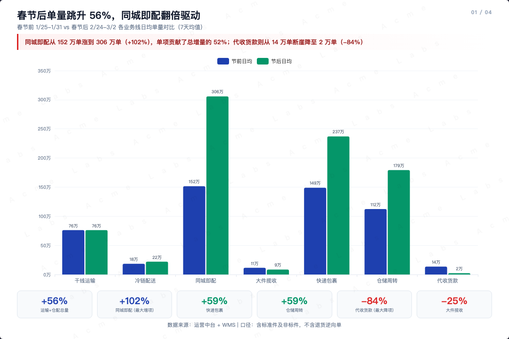 | 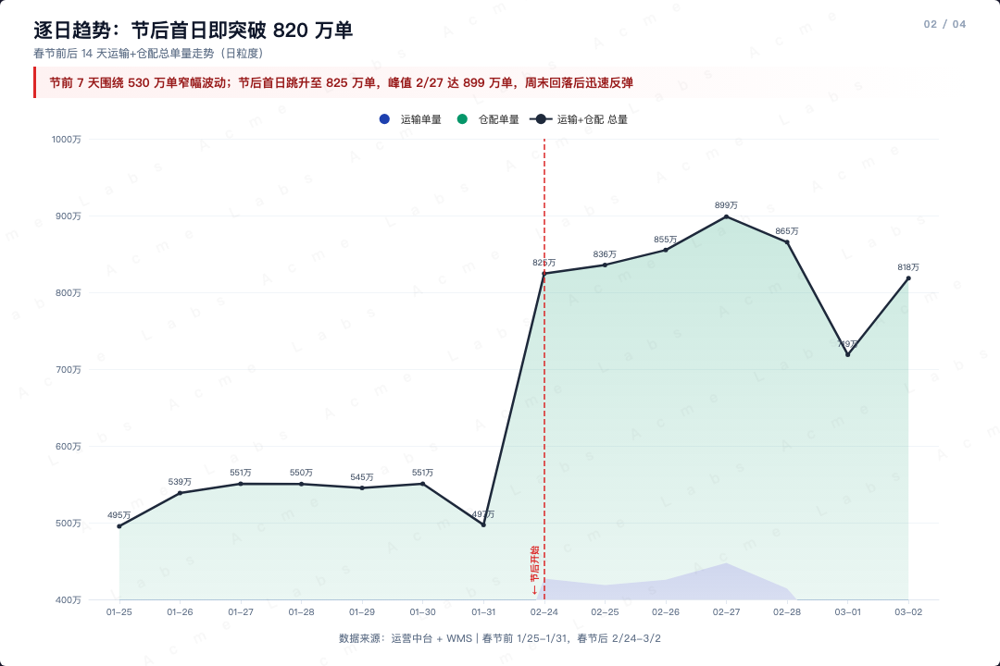 |
| 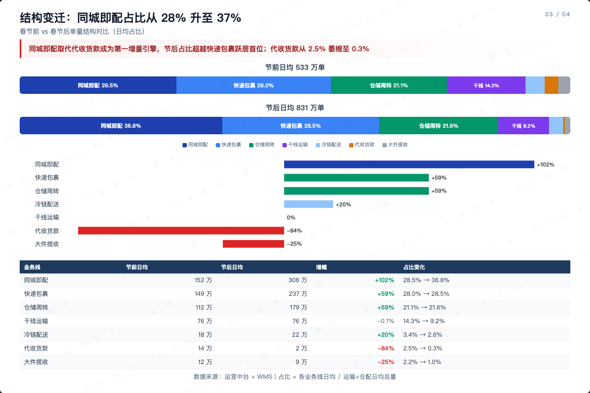 | 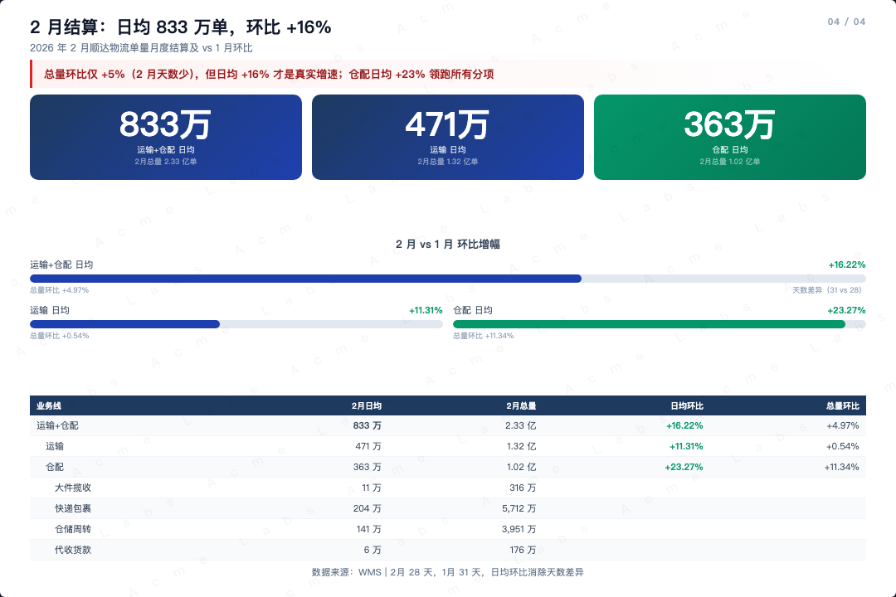 |

> Interactive HTML: [`demo/logistics/demo_slides.html`](demo/logistics/demo_slides.html)

### Demo 2: E-commerce Payment Monthly Report (8 slides)

Full payment operations report from Excel — daily trends, payment methods, category analysis, failure diagnostics, heatmap, user tiers, incident timeline.

**Source data**: [`demo/ecommerce-payment/ecommerce_payment_demo.xlsx`](demo/ecommerce-payment/ecommerce_payment_demo.xlsx) (8 sheets, 31 days)

| | |
|---|---|
| 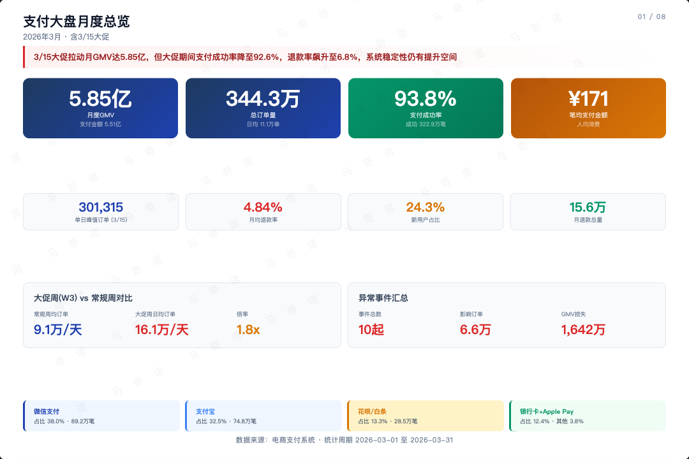 | 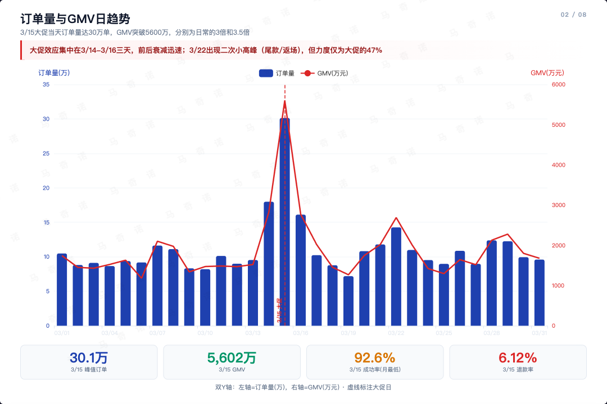 |
| 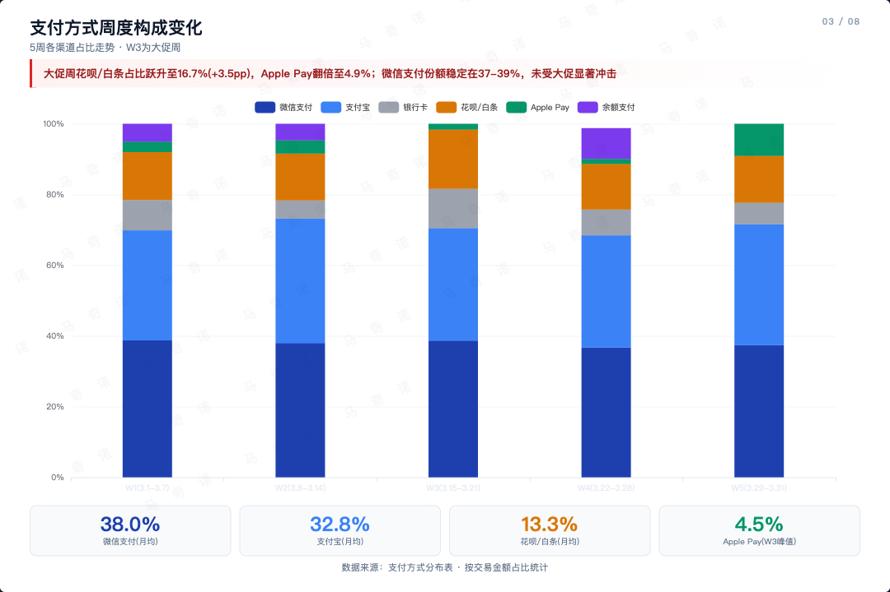 | 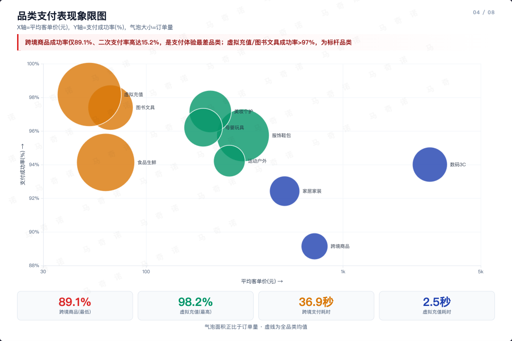 |
| 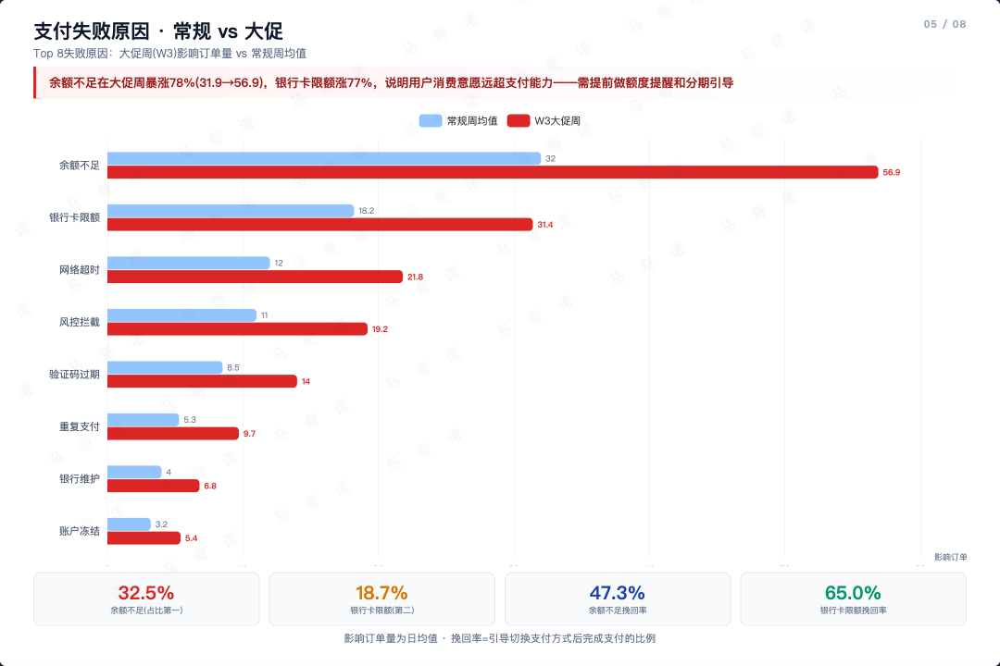 | 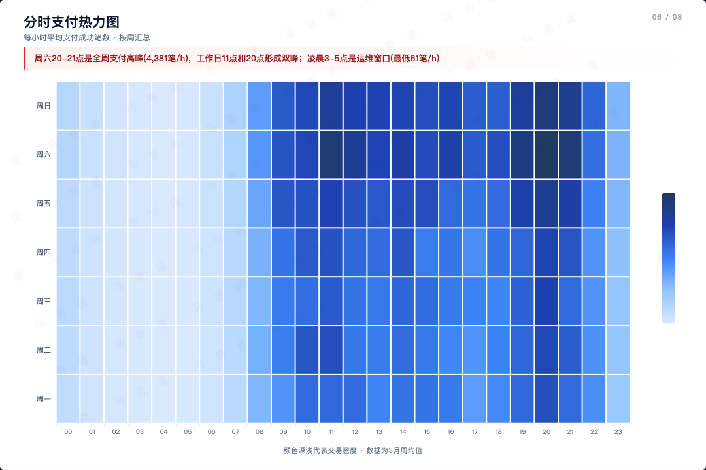 |
| 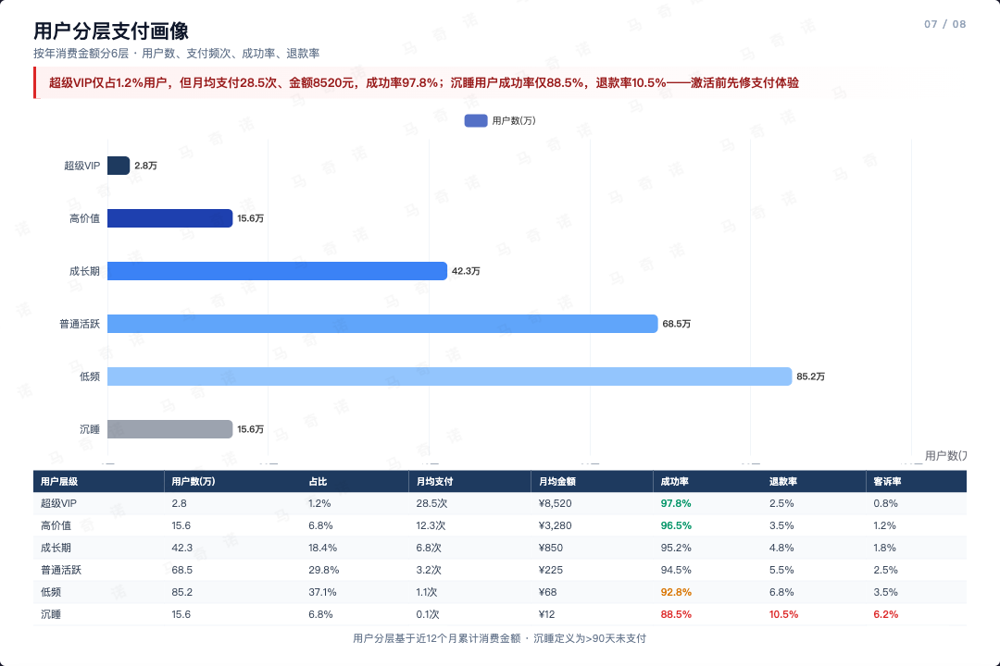 | 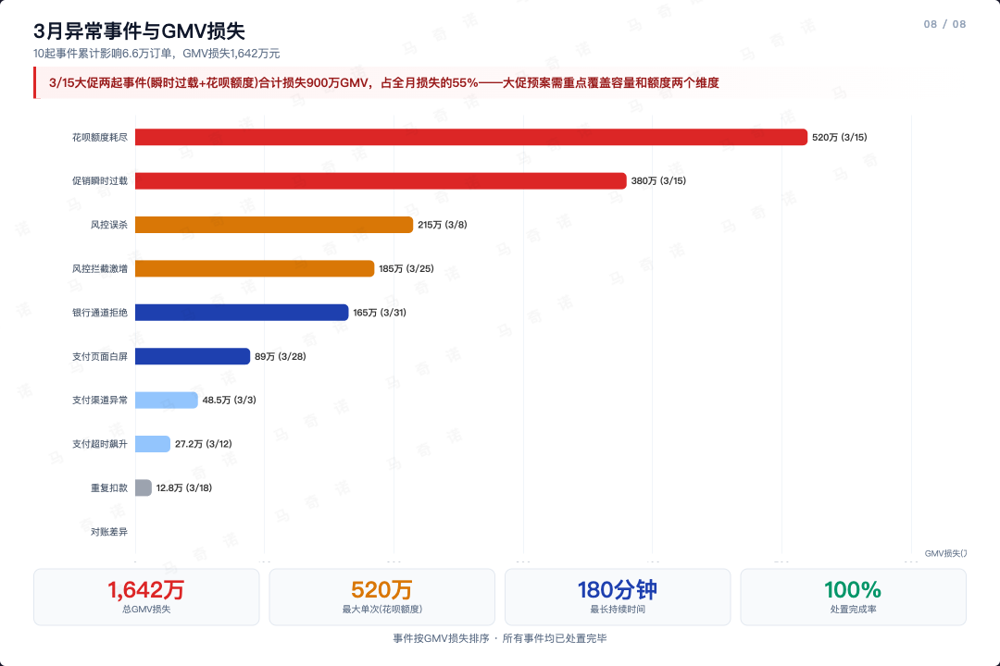 |

> Interactive HTML: [`demo/ecommerce-payment/ecommerce_payment_slides.html`](demo/ecommerce-payment/ecommerce_payment_slides.html)

## Design System

**5-layer slide structure**: header → takeaway → body → footer (fixed 720px height)

**Color palette**: blue (#1e40af) · red (#dc2626) · green (#059669) · amber (#d97706) · gray (#9ca3af)

**Components**: hero cards, stat boxes, insight callouts, layer bars, mini tables, finding cards, progress bars

**Charts**: scatter/bubble, grouped bar, stacked bar, proportion bar (ECharts, animation disabled for screenshot)

**Typography**: PingFang SC / system font stack, hero numbers 32-40px, body 11-13px

## How It Works

```
Your data  -->  Slide outline (user approves)  -->  HTML generation  -->  Playwright screenshot
```

1. **Understand**: Read data, identify metrics/comparisons/trends
2. **Outline**: Propose slide count and content per slide
3. **Generate**: Single HTML with ECharts + CSS cards
4. **Review**: Open in browser, iterate on spacing/data/readability
5. **Screenshot**: Playwright captures each slide at 1080x720

## Update

```bash
cd ~/.claude/skills/makino-data-slides && git pull
```

The skill checks for updates automatically on each run.

## FAQ

**Q: What data formats are supported?**
JSON, CSV, markdown tables, or just describe your data in natural language. The skill extracts structure and proposes a slide outline.

**Q: Can I customize colors?**
The default palette is investor-report style (blue/red/green/amber). You can override per-slide, but the palette is designed to work as a system.

**Q: How is this different from /chart?**
`/chart` generates individual charts (line, bar, pie, etc.). `/makino-data-slides` generates complete slide cards with multiple visual elements, typography, and narrative structure — designed as article illustrations.

**Q: How is this different from /article-to-slides?**
`/article-to-slides` converts finished articles into navigable presentations. `/makino-data-slides` creates static data cards from raw data — for embedding in articles, not replacing them.

**Q: Can I use this for non-Chinese content?**
Yes. The typography and layout work with English and Chinese. Just provide your data in any language.

**Q: The charts look blank in the screenshot.**
ECharts needs a moment to render. The Playwright screenshot script waits 500ms per slide. If charts are complex, increase the wait.

## Design System


## License

Apache 2.0 — see [LICENSE](LICENSE) and [NOTICE](NOTICE)

## Community & Contact

这两个项目目前都已上线，我会根据自己的使用情况和大家的反馈持续迭代。如果没有太多问题，后续会转入维护状态。所以**趁现在还在活跃开发期，有任何使用问题、功能建议、或者改进想法，欢迎随时反馈**，这对项目帮助很大。

| | |
|---|---|
|  |  |
| **飞书交流群** — 使用问题、Bug 反馈、功能建议 | **公众号「马奇诺」** — AI/Data/PKM 实践，后台留言也可以反馈 |

## Author

[makino](https://github.com/makinotes)
